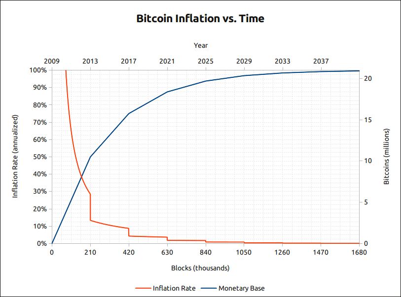
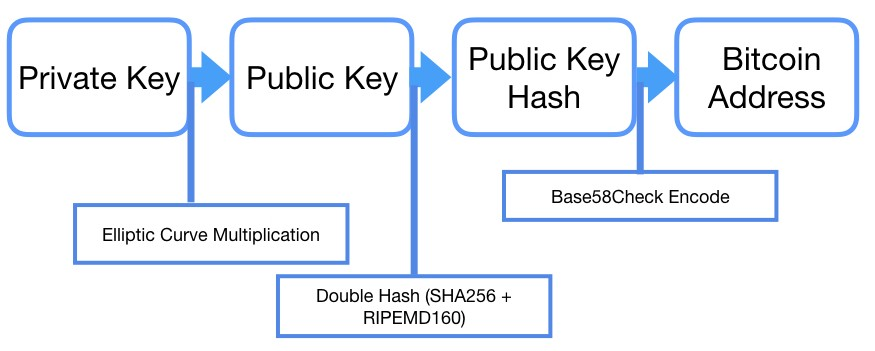

# Cryptocurrency

## Bitcoin's Monetary Policy
- **Halving**
Every 210,000 blocks or every 4 years, the nunber of Bitcoins per block is reduces by two.

- **Block Frequency**

# What are Unspent Transaction Outputs (UTXOs)
A UTXO is the amount of digital currency remaining after a cryptocurrency transaction is executed. UTXOs are processed continuously and are part of the beginning and end of each transaction. There is no sense of accounts in the context of cryptocurrencies all you have is UTXOs inputs and outputs.
# Where do transaction fees come from
Anything you don't account for in the output UTXOs become the fees of the transaction even though blockchain `theoratically` can be
free but there is a competition about mining blocks and confirming transations you need to put a fee. The higher the fee is the more
sooner it's get accepted
# How wallets work ?
There isn't actually a balance value in the Blockchain just list of UTXOs. The Wallets actually calculate the UTXOs sent to you and calculate the balance
# Signatures: Private & Public Keys
- There are two proceses:
    - Signing Process: (Message + Digital Signature[Hashed Message + Encryption using Private Key])
    - Verification Process: (Message + Digital Signature + Public Key)
- Public Key is generated from Private Key using `Elliptic Curve Multiplication`
- Bitcoin Address is generated from Public key using `Double Hash (SHA256 + RIPEMD160)` and then `Base58Check Encode` on the public key hash output
- Private key is a decimal number but public key is a hexadecmial one

By this we're mainting security and integrity of the blockchain

# What is Segregated Witness ? (SegWit)
- Segregated Witness (SegWit) refers to a change in Bitcoin's transaction format where the witness information was removed from the input field of the block. The stated purpose of Segregated Witness is to prevent non-intentional Bitcoin transaction malleability and allow for more transactions to be stored within a block.
- Signature and Public key `(scriptSig)` takes up to 60% of the whole transaction size
- It's called `Segregated Witnes`s because `scirptSig` used as a witness to verify that the who ownership of the message
# Public Key vs Bitcoin Address
People can sent you UTXOs either to your Bitcoin adress or Public key but the first one is more common and best practice to do that.

# Why you should avoid giving people your public key
Although generating private key from public key is almost impossible because of `elliptic function` used but may at somepoint in the future it's reversed engineered so by using bitcoin address you add another level of security to yours

# Hierachically Deterministic (HD) Wallets
Let's say one track your transactions over the blockchain by tracking the bitcoin address and public key that leads to patterns discovered affects your wallet security and it breaks the privacy concern of the bitcoin network so bitcoin comes with a solution found in `Bitcoin improvement proposals` in the additional resources attached below with something called `HD Wallets` you generate
only one `master private key` and create unlimited number of private and public keys and bitcoin addresses as well in addition to `master public key`. 

## Additional Resources
[Cryptocurrencies Market Capitalization](https://coinmarketcap.com/)
[Traditional Monetary Policy Explained](https://www.youtube.com/watch?v=gUGxGCW-k7o&t=2s)
[What Happens to Bitcoin After All 21 Million Are Mined?](https://www.investopedia.com/tech/what-happens-bitcoin-after-21-million-mined/)
[Bitcoin Monetary Inflation over time](https://chart-studio.plotly.com/~BashCo/5.embed?share_key=liQvkaTiHXjX2W41UiqzCn)
[Signatures & Keys Demo](https://tools.superdatascience.com/blockchain/public-private-keys/keys)
[Understanding Segwit Block Size](https://medium.com/@jimmysong/understanding-segwit-block-size-fd901b87c9d4)
[What is the Difference between public key and private key](https://www.reddit.com/r/Bitcoin/comments/3filud/whats_the_difference_between_public_key_and/)
[Bitcoin Improvement Proposal](https://github.com/bitcoin/bips)
[Deterministic Wallets, Their advantages and Their understated Flaws](https://bitcoinmagazine.com/technical/deterministic-wallets-advantages-flaw-1385450276)